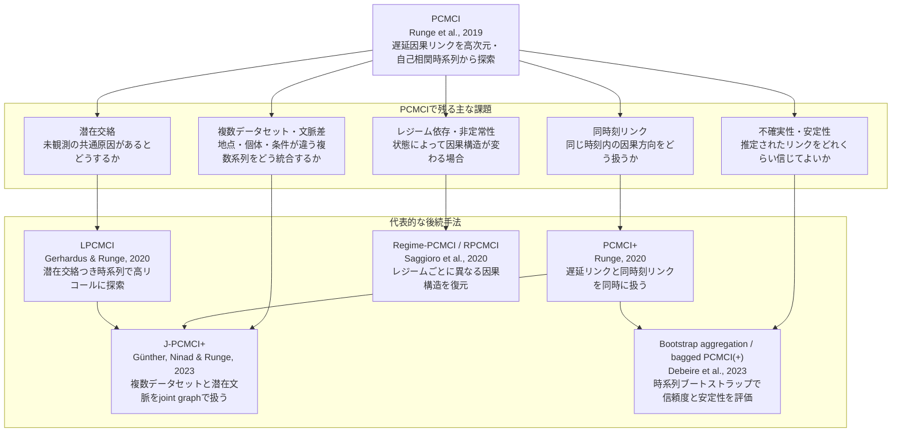

# 後続研究

## このノートの目的

PCMCI論文（Runge et al., 2019）の後続研究を、**どの限界に対応した発展なのか**という観点で整理する。

単なる文献リストではなく、輪講で「PCMCIのあと何が課題として残り、それに対してどんな手法が出たのか？」と聞かれたときに答えられる形にする。

関連：[[01_仮定と限界]]、[[../01. 論文読解/04_手法の流れ|手法の流れ]]

---

## 採用するMermaid形式

Obsidianでの互換性を優先して、`timeline` ではなく **flowchart形式の発展マップ**にする。

理由：

- `flowchart` はObsidianのMermaidで比較的安定して表示できる。
- 「課題 → 後続手法」という対応を矢印で表せる。
- ノード内に `年・手法・解決課題` をまとめて書ける。
- 年代順だけでなく、研究の分岐構造が見える。

---

## PCMCI後続研究の発展マップ



---

## 一覧表：名前・手法・解決課題・発表年

| 名前 | 発表年 | 手法の要点 | 解決しようとした課題 | PCMCIから見た位置づけ |
|---|---:|---|---|---|
| PCMCI+ | 2020 | PCMCIの条件集合最適化の考え方を拡張し、遅延リンクだけでなく同時刻リンクも扱う。CI検定の条件集合を工夫して、自己相関下でも検出力と偽陽性制御を改善する。 | 同時刻因果リンク、同時刻方向づけ、自己相関による検出力低下。 | 「PCMCIは主にラグつきリンクに強い」という読み方から一歩進み、同時刻リンクまで含む時系列因果グラフを狙う拡張。 |
| LPCMCI | 2020 | FCI系の潜在交絡対応と、PCMCI系の時系列向け条件集合選択を組み合わせる。親候補を早めに見つけ、条件集合に入れることでCI検定のeffect sizeを上げ、高リコールを狙う。 | 潜在交絡、自己相関時系列での低リコール、未観測変数による誤った直接リンク解釈。 | 「観測変数だけで十分」というPCMCIの強い前提を緩める方向。輪講ではPCMCIの仮定批判への重要な回答になる。 |
| Regime-PCMCI / RPCMCI | 2020 | PCMCIを、レジーム学習の最適化と組み合わせる。持続的な離散レジームを仮定し、レジームごとに定常な因果関係を復元する。 | 非定常性、状態依存の因果構造、気候レジームなどで関係が切り替わる状況。 | 「単一の定常因果グラフを推定する」というPCMCIの限界を、レジーム分割で拡張する方向。 |
| J-PCMCI+ | 2023 | 複数データセットをjoint graphとして扱い、system変数・context変数・dummy変数を含めて探索する。観測・潜在の時間的文脈や空間的文脈を扱う。 | 複数地点・複数個体・複数条件の時系列、データセット間の共通要因や局所要因、潜在contextによる交絡。 | PCMCI+を複数データセット設定へ広げる発展。気候・水文・個体差データなどで重要。 |
| Bootstrap aggregation / bagged PCMCI(+) | 2023 | 時系列依存とラグ構造を保つブートストラップを使い、複数回推定したグラフを多数決・集約する。リンクのconfidence measureを出す。 | 推定リンクの不確実性、サンプル揺らぎ、CI検定ベース手法の安定性評価。 | 「出てきたリンクをどれくらい信じるか？」への実務的な拡張。輪講では結果解釈・再現性の話に接続できる。 |


---

## 2024以降の論文が前回整理から漏れた理由

結論から言うと、**2024以降の関連論文は存在する**。前回の整理に入っていなかったのは、調査対象を「PCMCIファミリーの直系拡張」に寄せすぎたため。

前回の表は、主に次のようなものを優先していた。

- Tigramite公式ドキュメントで代表手法として整理されているもの。
- Runge周辺の流れとして、PCMCI → PCMCI+ / LPCMCI / RPCMCI / J-PCMCI+ に見えるもの。
- 手法名に `PCMCI` が明示的に含まれるもの。

そのため、2024以降に多い次のタイプを落としていた。

- PCMCIを比較対象・部品として使う応用論文。
- time series causal discovery全体の新手法。
- 非定常性、分布シフト、ロバスト性、仮定違反診断、ベンチマークに寄った研究。
- PCMCIという名前を冠していないが、PCMCIの限界と同じ問題意識に接続する研究。

輪講での言い方：

> 2024以降の関連研究がないわけではありません。PCMCI+やLPCMCIのような「PCMCI直系の代表拡張」は2020--2023あたりにまとまっています。その後は、非定常性、分布シフト、頑健性評価、ベンチマーク、仮定違反診断、実データ応用へ研究の焦点が広がっている、と見るのがよさそうです。

---

## 2024以降の最新論文情勢メモ

調査時点：2026-06-07。ここでは「PCMCIの直系拡張」だけでなく、PCMCIの限界・応用・評価に関係する周辺研究も含める。

| 名前                                                                                                                       |  発表年 | 手法・研究の要点                                                                              | PCMCIとの関係                            | 位置づけ              |
| ------------------------------------------------------------------------------------------------------------------------ | ---: | ------------------------------------------------------------------------------------- | ------------------------------------ | ----------------- |
| Causal Discovery in Semi-Stationary Time Series                                                                          | 2024 | 完全な定常性を仮定しない時系列因果探索。semi-stationary time series というクラスを考える。                           | PCMCIの定常性仮定への問題意識と接続。                | 非定常性への周辺発展。       |
| Robust Time Series Causal Discovery for Agent-Based Model Validation                                                     | 2024 | ABM検証のため、複雑でノイズの多い時系列に対するロバストな因果発見を扱う。                                                | PCMCI/PCMCI+系を含む既存手法のロバスト性問題に関係。     | 応用＋頑健性評価。         |
| Context-Specific Causal Graph Discovery with Unobserved Contexts: Non-Stationarity, Regimes and Spatio-Temporal Patterns | 2025 | 未観測context、非定常性、レジーム、時空間パターンを扱うcontext-specific causal graph discovery。               | J-PCMCI+ / RPCMCI の問題意識をさらに拡張する候補。   | 2025以降の重要候補。要精読。  |
| TimeGraph: Synthetic Benchmark Datasets for Robust Time-Series Causal Discovery                                          | 2025 | 時系列因果探索のための合成ベンチマークデータセット。時間構造やラグ構造を考慮した評価を狙う。                                        | PCMCI系手法を含む評価基盤に関係。                  | ベンチマーク・評価の発展。     |
| Causal Time Series Modeling of Supraglacial Lake Evolution in Greenland under Distribution Shift                         | 2025 | 分布シフト下での時系列因果モデリングを氷河湖変化へ応用。                                                          | PCMCI+やJ-PCMCI+的な「分布・文脈の違い」問題に接続。    | 応用研究。             |
| VCDF: A Validated Consensus-Driven Framework for Time Series Causal Discovery                                            | 2026 | 複数手法・複数設定の結果をconsensus的に検証し、ノイズ・非定常性・サンプリング変動に頑健な因果発見を狙う。                             | bagged PCMCI系と同じく「単発推定をどれだけ信じるか」に関係。 | 検証・consensus系の発展。 |
| Causal-Audit: A Framework for Risk Assessment of Assumption Violations in Time-Series Causal Discovery                   | 2026 | stationarity、regular sampling、bounded temporal dependence など、時系列因果探索の仮定違反リスクを評価する枠組み。 | PCMCIの仮定と限界を点検するためのメタ的研究として有用。       | 輪講の批判的質問にかなり有用。   |

### この見方での整理

2024以降は、「PCMCIそのものを少し変える」よりも、次の方向に広がっている。

1. **非定常性・レジーム・context**
   - 単一の定常因果グラフを仮定しにくい状況への対応。
   - RPCMCIやJ-PCMCI+の問題意識と接続する。

2. **ロバスト性・不確実性・consensus**
   - 1回のCI検定ベース推定をそのまま信じるのではなく、安定性や仮定違反を評価する方向。
   - bagged PCMCI(+)、VCDF、Causal-Audit などと接続。

3. **ベンチマーク・評価基盤**
   - 手法が増えるほど、どの条件でどの手法が壊れるかを評価する必要が出る。
   - TimeGraph のようなベンチマーク研究がここに入る。

4. **応用領域への展開**
   - 気候、氷河、電力需要、工業プロセス、金融、心理データなど。
   - ただし応用論文は、方法論上の後続研究と区別して読む必要がある。

### 今後ノートを拡張するときの方針

このノートでは、後続研究を次の2層で分けると見通しがよい。

```text
1. PCMCI直系の代表拡張
   - PCMCI+
   - LPCMCI
   - RPCMCI
   - J-PCMCI+
   - bagged PCMCI(+)

2. 2024以降の周辺発展
   - 非定常性・semi-stationary time series
   - context-specific causal discovery
   - ロバスト性・consensus・不確実性評価
   - ベンチマーク
   - 仮定違反診断
   - 分布シフト下の応用
```

TODO: 上の2024以降候補について、各論文のPDFを精読して「方法論上の後続研究」か「応用・評価研究」かを分類し直す。

---

## 各後続研究の読みどころ

### PCMCI+

**代表文献**：Runge, 2020, *Discovering contemporaneous and lagged causal relations in autocorrelated nonlinear time series datasets*。

PCMCI+は、PCMCIの自然な拡張として読むとよい。PCMCIは時系列のラグ構造を利用し、主に $\tau > 0$ の遅延リンクを探す枠組みとして理解しやすい。一方、実データでは「同じ時刻内でどちらが原因なのか」「測定間隔より速い効果が同時刻リンクとして現れるのではないか」という問題が残る。

PCMCI+はこの問題に対して、ラグつきリンクと同時刻リンクを同じ枠組みで扱う。論文要旨では、自己相関が強い場合でも、条件集合を最適化することでCI検定の信頼性を上げ、同時刻リンクの向きのrecallも改善すると説明されている。

輪講での答え方：

> PCMCI+は、PCMCIで残りやすい「同時刻リンクをどう扱うか」という問題への拡張です。PCMCIの条件集合選択の発想を使いながら、ラグあり・同時刻の両方の因果関係を探索します。

---

### LPCMCI

**代表文献**：Gerhardus & Runge, 2020, *High-recall causal discovery for autocorrelated time series with latent confounders*。

LPCMCIは、PCMCIの仮定のうち特に重要な **causal sufficiency（関係する共通原因が観測されている）** を緩める方向の発展。

潜在交絡があると、観測変数どうしのリンクが「直接因果」なのか「未観測の共通原因による見かけの関係」なのかが曖昧になる。これはFCI系アルゴリズムが扱ってきた問題だが、通常のFCI系手法は自己相関の強い時系列ではrecallが低くなりやすい。

LPCMCIは、親集合を条件集合に入れるとCI検定のeffect sizeが上がるという考え方を利用し、探索の途中で向きづけ規則を使って祖先関係を早めに推定する。NeurIPS 2020の要旨では、自己相関が強い連続時系列で既存手法より高いrecallを達成しつつ、false positiveを望ましい水準に保つと説明されている。

輪講での答え方：

> PCMCIは観測変数で十分という仮定が重要ですが、LPCMCIはそこを緩めて、潜在交絡がある時系列でも使えるようにした発展です。PCMCIの「親を条件集合に入れて検定を強くする」という発想を、FCI的な潜在交絡対応に接続しています。

---

### Regime-PCMCI / RPCMCI

**代表文献**：Saggioro et al., 2020, *Reconstructing regime-dependent causal relationships from observational time series*。

RPCMCIは、因果構造が時間を通じて同じとは限らない、という問題に対応する。

PCMCIの基本的な読み方では、十分長い観測期間にわたって1つの定常な因果構造を推定する。しかし、気候・経済・生体信号などでは、背景状態が切り替わると因果関係そのものが変わることがある。たとえば、ある気候レジームでは変数AがBに効くが、別のレジームでは効かない、という状況。

RPCMCIは、持続的な離散レジームを仮定し、PCMCIとレジーム学習最適化を組み合わせて、レジームごとの因果グラフを復元する。

輪講での答え方：

> RPCMCIは「因果グラフが1つに固定されている」というPCMCIの前提を疑う発展です。レジームごとに定常な因果関係があると見て、状態の切り替わりと因果グラフを一緒に推定します。

---

### J-PCMCI+

**代表文献**：Günther, Ninad & Runge, 2023, *Causal discovery for time series from multiple datasets with latent contexts*。

J-PCMCI+は、複数データセットがある場合の拡張。

たとえば、複数の河川流域、複数の気象観測地点、複数の個体から同じ種類の変数を観測している状況を考える。このとき、各データセットには共通する大規模要因もあれば、地点・個体に固有の要因もある。しかも、それらのcontextが完全には観測されていないことがある。

J-PCMCI+は、system変数、context変数、dummy変数を含むjoint causal graphを考え、複数データセットをまとめて扱う。PMLR/UAI 2023の要旨では、観測されたcontextと潜在contextの両方がある場合に、ラグを含むjoint causal time series graphを効率よく学習する非パラメトリック手法として説明されている。

輪講での答え方：

> J-PCMCI+は、PCMCI+を「複数データセット」へ拡張したものです。単にデータをプールするのではなく、データセット間で共有される文脈要因や、地点固有の文脈要因をグラフの中で扱うところがポイントです。

---

### Bootstrap aggregation / bagged PCMCI(+)

**代表文献**：Debeire et al., 2023, *Bootstrap aggregation and confidence measures to improve time series causal discovery*。

CI検定ベースの因果探索では、サンプルの揺らぎや検定の不安定さによって、リンクの有無が変わることがある。PCMCIでリンクが出たとしても、「そのリンクはどれくらい安定に出るのか？」は別問題。

この研究は、時系列の依存構造とラグ構造を保つブートストラップを使い、複数回グラフを推定する。得られたグラフを多数決で集約することでbagged causal discovery methodを作り、さらにリンクごとのconfidence measureを出す。

輪講での答え方：

> bagged PCMCI系の研究は、PCMCIの構造推定そのものを大きく変えるというより、推定結果の信頼度と安定性を評価・改善する方向です。実データで「このリンクをどれくらい信じてよいか」を議論するときに重要です。

---

## 輪講で聞かれそうな質問

### Q. PCMCI+とPCMCIの一番大きな違いは？

A. PCMCIは主にラグつきリンクを効率よく検出する枠組みとして読みやすい。一方、PCMCI+は同時刻リンクも含めて、ラグあり・同時刻の両方を探索する方向に拡張している。

補足：測定間隔が粗い場合、本当は短時間で起きている因果効果が同時刻リンクとして見えることがあるため、この拡張は実データでは重要。

### Q. LPCMCIが必要になるのはどんな場合？

A. 重要な共通原因が観測されていない可能性がある場合。PCMCIで見つかったリンクが、本当に直接因果なのか、未観測の共通原因による見かけの関係なのかを区別したいときに重要。

### Q. RPCMCIと非定常性の関係は？

A. RPCMCIは、非定常性を「レジームが切り替わることで、各レジーム内では別々の定常因果構造がある」と見る。つまり、完全に任意の非定常性を扱うというより、持続的で離散的なレジームを仮定している。

### Q. J-PCMCI+は単にデータを増やす話？

A. それだけではない。複数データセットを単純に結合すると、地点差・個体差・測定条件差が交絡になることがある。J-PCMCI+は、そのcontextをグラフの構成要素として扱う点が特徴。

### Q. bagged PCMCIは因果発見の新しい仮定を入れるもの？

A. 主眼は新しい因果仮定というより、推定の安定性と不確実性評価。時系列ブートストラップで複数のグラフを作り、リンクのconfidenceを見たり、多数決で頑健なグラフを得たりする。

---

## 今後読む順番

1. **PCMCI+**：PCMCIの直接拡張なので最優先。
2. **LPCMCI**：PCMCIの仮定批判、特に潜在交絡への答えとして読む。
3. **RPCMCI**：非定常性・気候レジームなどに関心があるなら読む。
4. **J-PCMCI+**：複数地点・複数個体・複数条件のデータを扱うなら読む。
5. **bagged PCMCI(+)**：実データ解析でリンクの信頼度を議論する段階で読む。

---

## 出典・確認元

- Tigramite documentation, method references：<https://jakobrunge.github.io/tigramite/>
- Runge, J. (2020). *Discovering contemporaneous and lagged causal relations in autocorrelated nonlinear time series datasets*. UAI 2020. arXiv:2003.03685. <https://arxiv.org/abs/2003.03685>
- Gerhardus, A. & Runge, J. (2020). *High-recall causal discovery for autocorrelated time series with latent confounders*. NeurIPS 2020. <https://proceedings.neurips.cc/paper/2020/hash/94e70705efae423efda1088614128d0b-Abstract.html>
- Saggioro, E., de Wiljes, J., Kretschmer, M. & Runge, J. (2020). *Reconstructing regime-dependent causal relationships from observational time series*. Chaos, 30(11), 113115. DOI: <https://doi.org/10.1063/5.0020538>
- Günther, W., Ninad, U. & Runge, J. (2023). *Causal discovery for time series from multiple datasets with latent contexts*. UAI 2023 / PMLR 216:766--776. <https://proceedings.mlr.press/v216/gunther23a.html>
- Debeire, K., Runge, J., Gerhardus, A. & Eyring, V. (2023). *Bootstrap aggregation and confidence measures to improve time series causal discovery*. arXiv:2306.08946. <https://arxiv.org/abs/2306.08946>
- Gao, S., Addanki, R., Yu, T. & Rossi, R. A. (2024). *Causal Discovery in Semi-Stationary Time Series*. arXiv:2407.07291. <https://arxiv.org/abs/2407.07291>
- Yu, G., Guo, C. & Luk, W. (2024). *Robust Time Series Causal Discovery for Agent-Based Model Validation*. arXiv:2410.19412. <https://arxiv.org/abs/2410.19412>
- Rabel, M. & Runge, J. (2025). *Context-Specific Causal Graph Discovery with Unobserved Contexts: Non-Stationarity, Regimes and Spatio-Temporal Patterns*. arXiv:2511.21537. <https://arxiv.org/abs/2511.21537>
- Ferdous, M. H., Hossain, E. & Gani, M. O. (2025). *TimeGraph: Synthetic Benchmark Datasets for Robust Time-Series Causal Discovery*. arXiv:2506.01361. <https://arxiv.org/abs/2506.01361>
- Hossain, E., Ferdous, M. H. & Dunmire, D. (2025). *Causal Time Series Modeling of Supraglacial Lake Evolution in Greenland under Distribution Shift*. arXiv:2510.15265. <https://arxiv.org/abs/2510.15265>
- Yu, G., Guo, C. & Luk, W. (2026). *VCDF: A Validated Consensus-Driven Framework for Time Series Causal Discovery*. arXiv:2602.21381. <https://arxiv.org/abs/2602.21381>
- Ruiz, M., Arana-Catania, M. & Ardila, D. R. (2026). *Causal-Audit: A Framework for Risk Assessment of Assumption Violations in Time-Series Causal Discovery*. arXiv:2604.02488. <https://arxiv.org/abs/2604.02488>

---

## TODO

- TODO: PCMCI+論文を読んで、PCMCIとのアルゴリズム差分を図解する。
- TODO: LPCMCIの PAG / FCI 系の記号を、[[../02. 前提知識解説/条件付き独立性|条件付き独立性]] と接続して整理する。
- TODO: RPCMCIの「レジーム学習最適化」が具体的に何を目的関数にしているか確認する。
- TODO: J-PCMCI+の system / context / dummy 変数の具体例を1つ作る。

## 関連ノート

- [[01_仮定と限界]]
- [[03_輪講_QA]]
- [[04_残TODO]]
- [[../01. 論文読解/00_索引|論文読解索引]]
- [[../01. 論文読解/04_手法の流れ|手法の流れ]]
- [[../02. 前提知識解説/条件付き独立性|条件付き独立性]]
