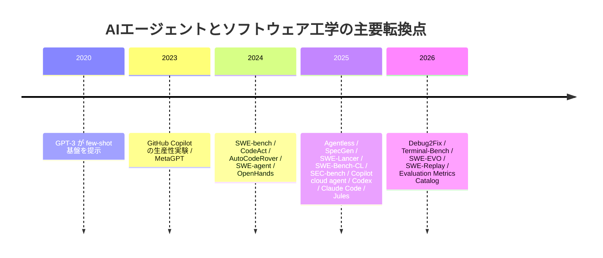
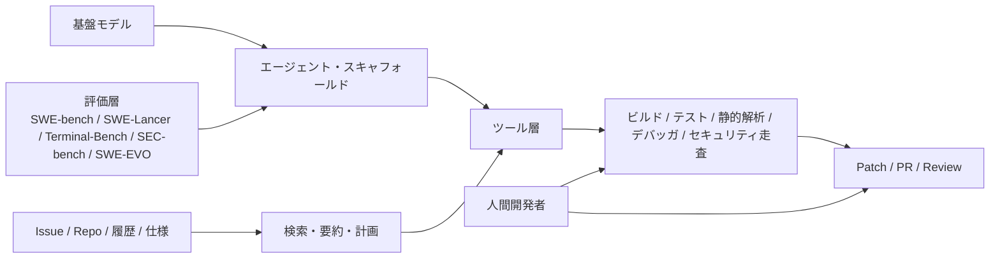

# AIエージェントとソフトウェア工学の研究・実装動向

## エグゼクティブサマリ

2024年以降、ソフトウェア開発向けAIは、単なるコード補完やチャット支援から、**リポジトリ全体を理解し、Issueを読み、ブランチを切り、ファイルを編集し、テストやコマンドを実行し、PRとして成果を返す「エージェント」**へと急速に移行した。2026年6月時点では、GitHub Copilot cloud agent、OpenAI Codex、Anthropic Claude Code、Google Jules、Amazon Q Developer などが、IDE内・ターミナル内・クラウド上でそれぞれ異なる実行形態を提供しており、商用化はすでに本格段階に入っている。特に、**低〜中難度のバグ修正、テスト追加、リファクタリング、依存更新、ドキュメント整備、リポジトリQ&A**のように、入力仕様が比較的明確で、ビルド・テスト・レビューによる検証が可能なタスクで実用化が進んでいる。 citeturn23search0turn23search7turn31search8turn24search6turn4search0turn4search7turn5search0turn6search5

研究面では、焦点が「LLMはコードを書けるか」から、「**エージェント・スキャフォールド**をどう設計するか」「**どのツールをどう接続するか**」「**どのベンチマークで何を測るか**」へと明確に移った。SWE-bench と SWE-agent が現実的な Issue 解決をベンチマークと実装の両面で定着させ、AutoCodeRover は構文木・コード検索・fault localization を組み込んだSE寄りの設計を提示し、Agentless は複雑なエージェント化なしでも強い性能が得られることを示した。さらに、SpecGen、ユニットテスト生成研究、SWE-Bench-CL、SEAlign、Debug2Fix、SEC-bench、SWE-EVO などにより、対象タスクは**仕様生成、テスト、継続学習、デバッグ、性能最適化、セキュリティ、長期進化**へと急速に広がっている。 citeturn1search8turn1search6turn16search0turn16search2turn12search0turn28search0turn27search0turn27search1turn12search5turn26search0turn19search1

ただし、**ベンチマーク上の進歩が、そのまま本番運用上の自律性を意味するわけではない**。AIDev データセットは、Codex、Devin、GitHub Copilot、Claude Code などのエージェントがすでに大規模にGitHub上でPRを生成していることを示す一方、**エージェントPRは人間より速いが、受理率では不利**であると報告している。Sonarの2026年調査でも、開発者の96%がAI生成コードを完全には信頼しておらず、常に検証してからコミットすると答えたのは48%に過ぎない。さらに、SWE-EVO では長期進化タスクで GPT-5 + OpenHands 構成が21%解決にとどまり、SEC-bench でもPoC生成18%、脆弱性修正34%が上限と報告されている。つまり、現状の主戦場は「**完全自律**」ではなく、「**信頼・検証・監査を伴う半自律**」である。 citeturn25search0turn25search1turn18search2turn18search15turn19search1turn26search0

実務への含意は明確である。短中期では、AIエージェントを**人間の代替者**としてではなく、**PR単位で作業を引き受ける検証可能な作業者**として導入するのが最も合理的である。導入の鍵は、AGENTS.md や Skills、MCP、plugins などでリポジトリ規約と作業手順を外部化し、テスト・静的解析・セキュリティスキャン・レビューを品質ゲートとして強化し、権限をサンドボックスと承認フローで厳格に管理することにある。研究的にも実務的にも、今後3〜5年の中心テーマは「自律性の増大」そのものより、**信頼可能な自律性**、すなわち *programming with trust* になる可能性が高い。 citeturn24search0turn24search3turn23search16turn4search21turn9search21turn32search0turn31search6turn30search2turn17search3

## 調査範囲と全体動向

本稿は、**2020年から2026年6月12日まで**を対象に、直近5年を中心としつつ、重要な基礎参照も含めて整理した。優先ソースは、arXiv、OpenReview、ACM/IEEE、ICSE/FSE/ASE/NeurIPS/ICLR 等の主要会議・論文、主要企業の公式技術ブログ・公式ドキュメント・ホワイトペーパー、そして主要OSSの公式リポジトリと公式ドキュメントである。比較は、各製品のベンチマーク値の直接優劣ではなく、**機能・ワークフロー・ガバナンス・適用可能タスク**を軸に行った。製品の機能や料金・提供範囲は変化が速いため、記述は2026年6月12日時点で確認できた公開情報に基づく。 citeturn23search2turn24search6turn4search0turn9search0turn21view0

この期間の変化を一言でいえば、**「コード生成」から「ソフトウェア工学ワークフローの自動化」への重心移動**である。初期には few-shot やペアプログラミングの延長として理解されたが、2024年以降は、Issue解決・テスト実行・ブラウズ・端末操作・PR作成まで含む agentic workflow が主役になった。そして2025年以降は、さらに「より大きなコードベース」「より長い時間幅」「より強い安全・統治要求」を扱うための評価軸と製品アーキテクチャが整備され始めている。 citeturn14search1turn15search9turn1search8turn1search6turn16search0turn17search3turn19search1turn17search1

| 期間 | 技術的転換 | 代表的な根拠 |
|---|---|---|
| 2020–2023 | 基盤モデルとAI支援開発の実証段階。few-shot 大規模言語モデルと、GitHub Copilot の生産性実験が基礎を作った。 | GPT-3 は few-shot 能力を大規模に示し、GitHub Copilot 実験では処置群が 55.8% 速く課題を完了した。MetaGPT は multi-agent 開発フローをいち早く定式化した。 citeturn1search14turn14search1turn15search9 |
| 2024 | ベンチマーク化とスキャフォールド競争の開始。Issue 解決・リポジトリ探索・ツール利用が研究の中心になった。 | SWE-bench、CodeAct、AutoCodeRover、SWE-agent、OpenHands が相次いで公開され、現実的なSEタスクを扱う流れが定着した。 citeturn1search8turn16search1turn16search0turn1search6turn15search0 |
| 2025 | 商用化の本格化と評価領域の拡張。agentless、仕様生成、継続学習、性能・セキュリティ・マネジメント系ベンチマークが増加。 | Copilot coding agent、Codex、Claude Code GA、Jules、Amazon Q、Junie、Devin が並走し、SWE-Lancer、SWE-Perf、SWE-Bench-CL、SEC-bench、SEAlign が評価・学習面を広げた。 citeturn3search6turn31search8turn4search7turn5search0turn6search1turn6search2turn11search7turn13search1turn19search15turn27search0turn26search0turn27search1 |
| 2026 | 長期タスク・デバッグ・再現性・評価メタ研究が前面化。 | Debug2Fix、Terminal-Bench、SWE-EVO、SWE-Replay、ICSE 2026 AGENT の metric catalog は、長期タスク・コスト・再現性・評価標準化への関心の高まりを示す。 citeturn12search5turn13search3turn19search1turn19search2turn17search1 |

このタイムラインから読み取れる最重要点は、競争軸が**モデル単体のコード生成能力**から、**検索・計画・実行・検証・ガバナンスを含む“エージェント実装全体”**へ移ったことだ。AutoCodeRover はAST/検索/定位を組み込み、SWE-agent は agent-computer interface を導入し、Agentless は逆に複雑なエージェント化を削った。Debug2Fix はデバッガ統合の効果を示し、SWE-Replay は test-time scaling の効率改善を狙う。つまり、現在の最前線は「より大きいモデル」だけではなく、**よりよい作業面と検証ループ**の設計にある。 citeturn16search0turn1search6turn16search2turn12search5turn19search2

## 実用化状況と主要プロジェクト

実用化の広がりは、**同期型補助**、**非同期型委任**、**自社統治型プラットフォーム**の3類型で理解すると整理しやすい。同期型は IDE やターミナルで人間と一緒に作業する Claude Code、aider、Copilot agent mode などであり、非同期型は GitHub 上やクラウドサンドボックスで Issue を受け取って PR を返す Copilot cloud agent、Codex、Jules、Devin が中心である。自社統治型には、OpenHands Enterprise の self-host、IBM の enterprise agentic environment、Amazon Q のセキュリティ走査、GitHub のポリシー管理が入り、**データ所在・権限制御・監査可能性**が採用条件になっている。これは製品間の単なるUI差ではなく、企業がAIエージェントに何を委任できるかを規定する制度設計の差でもある。 citeturn4search0turn23search0turn31search8turn5search0turn11search7turn8search1turn7search8turn6search5turn30search2

### 商用製品の比較

| 製品 | 実行面 | 代表機能 | ガバナンス・拡張 | 向く用途 | 主な出典 |
|---|---|---|---|---|---|
| GitHub Copilot cloud agent | GitHub / IDE / CLI | リポジトリ調査、実装計画、ブランチ上の編集、PR作成。Issue割当も可能。 | 全有料Copilotプラン。Business/Enterprise向けポリシー、リポジトリ単位無効化、MCP と custom agents。 | 既存GitHub運用の延長での非同期修正、テスト追加、軽度の機能実装。 | citeturn23search0turn23search7turn30search2turn23search16turn3search6 |
| OpenAI Codex | ChatGPT / Web / CLI / App / IDE | コード作成、バグ修正、コードベースQ&A、並列タスク、PR提案。 | AGENTS.md、Skills、Subagents、sandbox、approval policy、network controls。 | 並列実行とプロジェクト規約の明文化を前提にしたクラウド/ローカル併用開発。 | citeturn31search8turn24search6turn24search0turn24search3turn24search9turn31search6 |
| Anthropic Claude Code | ターミナル / IDE / デスクトップ / Web / GitHub Actions / GitLab | コードベース読解、ファイル編集、コマンド実行、背景タスク、subagents。 | 既定は read-only、明示承認、sandboxed bash、plugins、skills、hooks。 | IDE中心の協調作業、CI/CD統合、比較的密な人間レビューを伴う運用。 | citeturn4search0turn4search6turn4search7turn4search13turn4search21turn32search0turn32search7 |
| Google Jules | クラウド / GitHub / CLI / API | 非同期型コーディング、テスト作成、バグ修正、機能追加、依存更新、音声 changelog。 | secure cloud environment、API、CLI companion。 | バックログ処理、依存更新、GitHub連携の非同期自動化。 | citeturn5search0turn5search3turn5search2turn5search4turn5search17 |
| Amazon Q Developer | IDE / CLI / AWS Console / GitLab / Chat | コード生成・デバッグ・リファクタリング、private repo 接続、脆弱性走査、agentic coding。 | ビルド/テストで生成コードをリアルタイム検証、AWS統合。 | クラウドネイティブ開発、AWS内製基盤、セキュリティ重視の組織。 | citeturn6search5turn6search17turn6search1 |
| IBM watsonx Code Assistant / Bob | 企業向け環境 / モダナイゼーション | エンドツーエンドのSDLC支援、テスト自動化、レガシー変換、Z/COBOL近代化。 | enterprise governance、用途特化モデル、Code Assistant for Z。 | メインフレームや大規模企業システムの近代化。 | citeturn7search8turn7search12turn7search11turn11search6 |
| Cognition Devin | クラウド作業環境 | 長期推論と計画、shell/editor/browser を備えた sandbox 上での自律実行。 | エージェント品質の継続改善を前提とした運用。 | 長時間タスク、マルチステップ修正、独立した委任作業。 | citeturn11search7turn11search0 |
| JetBrains Junie | JetBrains IDE | routine task の委任、複雑タスクでの co-creation、IDE内協働。 | IDE統合前提、JetBrains ワークフローとの親和性。 | 既存 JetBrains ユーザーの段階的導入。 | citeturn6search2turn6search14 |

### 主要OSSの比較

| OSS | 実行面 | 代表機能 | 強み | 主な出典 |
|---|---|---|---|---|
| OpenHands | Web / CLI / headless / GitHub Action / Enterprise | コード編集、コマンド実行、Web閲覧、API 呼び出し、GitHub Action、自社VPC self-host。 | model-agnostic、LiteLLM接続、CI/CD・自社運用に向く。 | citeturn9search6turn9search4turn9search13turn9search1turn8search1 |
| SWE-agent / mini-SWE-agent | CLI / GitHub issue workflow | Issue解決、LM選択自由、軽量実装。 | ベンチマーク志向が強く、実験再現や研究プロトタイプに向く。 | citeturn8search0turn8search4turn8search8turn21view0 |
| aider | ターミナル | 対話型編集、voice-to-code、自動 lint/test と修正。 | 個人開発者に導入が容易、ローカル主導。 | citeturn8search3 |
| MetaGPT | フレームワーク / product bridge | SOPに基づく multi-agent 協調、自然言語プログラミング、MGX。 | 役割分担と業務フローの形式化が明確。 | citeturn15search9turn15search5 |

この比較から、市場は単一の勝者に収束しているのではなく、**「GitHub中心の非同期PR型」「IDE中心の同期共創型」「ローカル/自社運用型」**へと分岐していると解釈できる。また、OpenAI の AGENTS.md と Skills、GitHub の MCP と custom agents、Anthropic の plugins/subagents、OpenHands の global skills など、主要プレイヤーはそろって**拡張機構の外部化**へ向かっており、エージェントは「一つの製品」よりも「構成可能な実行基盤」へ近づいている。 citeturn24search0turn24search3turn23search16turn4search21turn9search21

### 実用化事例

| 事例 | 分野 | 観測された価値 | 含意 | 主な出典 |
|---|---|---|---|---|
| GitHub Secret Protection engineering で Copilot coding agent を活用 | セキュリティ製品開発 | validity check coverage の拡張を加速。 | セキュリティ系でも「検証しやすいサブタスク」は委任可能。 | citeturn3search13 |
| OpenAI Harness の agent-first 製品開発 | 新規プロダクト開発 | 空のリポジトリに対し、構造・CI・formatting・package manager・AGENTS.md を Codex CLI が初期生成。 | グリーンフィールドでは scaffold 生成の効果が高い。 | citeturn2search5 |
| IBM 内部での watsonx Code Assistant 導入研究 | 企業内ソフトウェア開発 | N=669 の調査と N=15 の usability study で、総じて生産性増が見られた一方、全員が同等に恩恵を受けるわけではなかった。責任帰属も論点化。 | 効果は一様ではなく、チーム・タスク・経験差が大きい。 | citeturn11search3 |
| IBM watsonx Code Assistant for Z の NOSI 事例 | レガシー近代化 / 官公庁 | 分析・自動リファクタリング・コード説明・変換・テストまでのエージェント型ワークフローを提示。 | 近代化は ROI が明確で、エージェント適用が進みやすい。 | citeturn7search12 |
| Devin の 2025 performance review | 汎用ソフトウェア開発 | 18か月で PR merge 率が 34% から 67% へ上昇し、何千社にも組み込まれたと報告。 | 本番運用は進むが、品質改善は継続的チューニング前提。 | citeturn11search0turn11search4 |
| GitHub Copilot の controlled / field evidence | 汎用開発支援 | controlled experiment では 55.8% 高速化、field experiment では Microsoft で 12.92–21.83%、Accenture で 7.51–8.69% 多い PR/週という示唆的結果。 | 効果は存在するが、現場では採用率や組織要因で薄まる。 | citeturn14search1turn14search17 |

実用化の横断的傾向としては、**SaaS/クラウド開発・OSS保守・セキュリティ支援・レガシー近代化**が先行分野である。理由は、いずれもタスクの粒度が比較的明確で、GitHub・CI・テスト・静的解析など既存の検証資産に接続しやすいからだ。一方で、純粋な速度向上だけでは十分でなく、IBM研究が指摘する責任帰属の問題や、AIDev の示す採択率ギャップが、実運用のボトルネックとして残っている。 citeturn11search3turn25search0turn25search1

## 研究トピックと代表論文

研究トピックは大きく七つに分かれる。第一に、**自動コード生成・Issue解決**であり、これは現在の主流である。SWE-bench と SWE-agent が事実上の最重要基準を形成し、AutoCodeRover や Agentless が「何を読ませ、どのように探索し、どの段階で検証するか」を競っている。第二に、**テスト自動化**で、ユニットテスト生成はFSE/ASE系で急速に成熟している。第三に、**仕様推論・仕様生成**で、SpecGen のように formal specification 生成へ踏み込む研究が増えている。第四に、**デバッグ支援**で、Debug2Fix のように debugger を第一級ツールとして統合する方向が現れた。第五に、**継続的学習・自己改善**で、SWE-Bench-CL、SEAlign、Live-SWE-agent がその代表である。第六に、**マルチエージェント協調**で、MetaGPT、MAGIS、DEI が役割分担と集団推論を探っている。第七に、**セキュリティ・倫理・信頼性**であり、Security of AI Agents、SEC-bench、Programming with Trust がこの流れを理論・評価の両面で押し上げている。 citeturn1search8turn1search6turn16search0turn16search2turn28search0turn12search0turn12search5turn27search0turn27search1turn20search0turn15search9turn15search2turn15search7turn17search2turn26search0turn17search3

特に重要なのは、**「高性能なエージェント = たくさんのエージェントを並べたもの」ではない**という点だ。MAGIS や DEI は multi-agent の有効性を示す一方で、Agentless は単純な三段階設計で強い性能を出し、AutoCodeRover はむしろ静的解析や fault localization といった古典的SE技法の再統合によって成果を出した。Debug2Fix も、モデルを変えるより**デバッガという観測装置**を与える方が有効な場合があると示している。したがって、現在の研究フロンティアは「何個のエージェントを置くか」ではなく、**どの中間表現と観測をエージェントに持たせるか**にある。 citeturn15search2turn15search7turn16search2turn16search0turn12search5

この関係図が示す通り、ソフトウェア工学エージェントの価値は、基盤モデルだけではなく、**コンテキスト構築・ツール利用・検証・レビュー接続**の全体設計で決まる。現代的な製品・論文の多くは、この図の「ツール層」と「評価層」をどれだけ強化できるかを競っている。 citeturn16search1turn1search6turn15search0turn12search5turn13search1turn13search3turn26search0turn19search1

### 代表的論文

| 論文 | 会議・年 | 主題 | 要旨・貢献 | 手法・評価の要点 | 引用状況の目安 | 主な出典 |
|---|---|---|---|---|---|---|
| The Impact of AI on Developer Productivity | Microsoft Research / 2023 | 生産性評価 | GitHub Copilot を用いた controlled experiment で、AI支援の生産性影響を定量化した初期の重要研究。 | JavaScript の HTTP server 実装課題で、処置群は 55.8% 速く完了。 | 約1,259 | citeturn14search1turn14search9 |
| MetaGPT | ICLR 2024 Oral | マルチエージェント開発フロー | SOP を prompt sequence に落とし込み、人間組織に似た役割分担でソフトウェア生成を行う枠組みを提示。 | role-based multi-agent 協調。 | 約3,065 | citeturn15search9turn15search1 |
| SWE-bench | ICLR 2024 Oral | 現実的SEベンチマーク | 2,294件の実GitHub Issue と対応PRからなる評価基盤を導入し、以後の研究の共通土台を作った。 | 12 Python repo、Repository-level issue resolution。 | 約2,944 | citeturn1search0turn1search8 |
| CodeAct | ICML 2024 | 行動空間設計 | 自然言語ツール呼び出しではなく、実行可能 Python code を agent action とする統一行動空間を提案。 | API-Bank 等で広範評価、最大 20% 高い成功率。 | 約252 | citeturn16search1 |
| AutoCodeRover | ISSTA 2024 | 自動 program improvement | GitHub issue 解決のために、ASTベース検索と fault localization を組み合わせたSE志向の設計を提示。 | SWE-bench Lite で 19%、平均コスト $0.43。 | 約539 | citeturn16search0turn16search4 |
| SWE-agent | NeurIPS 2024 | agent-computer interface | LLM agent 向けに特化した ACI を設計し、ファイル編集・リポジトリ移動・テスト実行の能力を大きく高めた。 | SWE-bench で custom ACI の効果を実証。 | 約1,620 | citeturn1search6turn1search2 |
| OpenHands | ICLR 2025 | オープンプラットフォーム | コード編集、CLI、Web閲覧、sandbox、安全実行、multi-agent、benchmark統合を備えたコミュニティ基盤。 | generalist / specialist agent の研究基盤。 | 約781 | citeturn15search0turn15search4 |
| Agentless | 2024 preprint / 後続FSE分析 | 単純化された Issue 解決 | localization → repair → validation の三段階で、複雑な agent loop を使わずに高い性能と解釈性を示した。 | simple interpretable baseline、SWE-bench Lite-S 提案。 | 約407 | citeturn16search2turn16search13 |
| SpecGen | ICSE 2025 | 仕様生成 | LLM による formal program specification 生成を提案し、コード理解能力を仕様生成へ転用。 | 既存 template/grammar ベース手法を上回る。 | 約147 | citeturn12search0turn12search3 |
| Evaluating and Improving ChatGPT for Unit Test Generation | FSE 2024 | テスト自動化 | ChatGPT のユニットテスト生成能力を初めて体系評価し、ChatTESTER で改善した。 | 34.3% 多い compilable tests、18.7% 多い correct assertions。 | 約213 | citeturn28search0turn28search7turn28search14 |

被引用の面では、**SWE-bench、SWE-agent、MetaGPT** がこの分野の中核文献になっている。SWE-bench と SWE-agent は現在でもほとんどすべての issue-resolution 研究の参照点であり、MetaGPT は multi-agent ソフトウェア生成の初期標準として使われている。一方で、AutoCodeRover、Agentless、SpecGen、ユニットテスト生成研究のような「よりSE固有の課題に近い」論文群は、被引用数ではやや小さいものの、現在の実装設計や企業プロダクトに対する示唆が大きい。つまり、**被引用規模と実務インパクトは完全には一致しない**。 citeturn1search8turn1search6turn15search9turn16search0turn16search2turn12search0turn28search0

## 技術課題と評価の争点

技術的な未解決問題は、**スケーラビリティ、信頼性、説明可能性、継続学習、セキュリティ、評価指標**の六つに整理できる。2026年の議論で重要なのは、これらがもはや別々の問題ではなく、相互に結びついていることだ。たとえば、長いリポジトリでのスケーラビリティを高めるには探索過程の要約が必要だが、それは説明可能性と再現性の問題を帯びる。逆に、安全のために権限を絞ると、自律性や完遂率が下がる。したがって、最適化対象は solve rate 単体ではなく、**cost、steps、tool efficiency、test-pass、mergeability、security assurance** を含む多目的最適化になりつつある。 citeturn19search2turn17search1turn17search0turn25search0turn18search15

| 課題 | 現在の主な解決アプローチ | 代表的な評価指標・ベンチマーク | なお残る問題 | 主な出典 |
|---|---|---|---|---|
| 大規模リポジトリと長期タスク | AST/構造検索、fault localization、dynamic workflows、test-time scaling、branching reuse | SWE-bench Pro、SWE-EVO、Terminal-Bench、Resolved rate、Fix Rate、cost/steps | 長期進化では性能が大きく低下。SWE-EVO では GPT-5 + OpenHands でも 21% にとどまる。 | citeturn16search0turn4search4turn19search2turn13search2turn19search1turn13search3 |
| 機能的正しさと信頼性 | build/test 実行、patch validation、debugger 統合、security scan、PR review | test-pass、resolved、Migration Coverage、PR merge/acceptance | 変換や移行が形式的に成功しても、動作維持は別問題。Copilot migration study では coverage 100% median でも test-pass は 39.75% median。 | citeturn6search17turn12search5turn31search13turn29search0turn25search0 |
| 説明可能性とレビュー容易性 | plan generation、session logs、diff review、AGENTS.md、skills、PR中心のUX | review latency、acceptance、traceability | 暗黙の設計制約・内製API・組織ルールはなお漏れやすい。 | citeturn23search0turn24search0turn24search3turn25search0turn25search10 |
| 継続学習と自己改善 | semantic memory、CL benchmark、alignment training、self-improving/live agents | forgetting、forward/backward transfer、tool-use efficiency、Composite CL Score | catastrophic forgetting や benchmark overfitting、自己改善の安全統治が未解決。 | citeturn27search0turn27search1turn20search3turn20search0 |
| セキュリティと安全性 | sandbox、approval、network control、policy management、security benchmark | SEC-bench、SEC-bench Pro、PoC success、patch success | Security task では成功率がなお低く、エージェント自体の攻撃面も増える。 | citeturn31search6turn32search0turn30search2turn26search0turn26search8turn17search2 |
| 評価の再現性と標準化 | metric catalog、LLM empirical guidelines、現実データセット | solve rate 以外に cost、step、fix rate、acceptance、maintenance を測る | モデル更新が速く、閉鎖モデルでは再現性が弱い。ベンチマーク→本番の外的妥当性も限定的。 | citeturn17search1turn17search0turn25search0turn25search5 |

評価指標の観点では、2024年まで支配的だった「Solved / Resolved %」だけでは不十分になっている。SWE-bench 公式は resolved とともに cost/steps 比較を前面に出し、SWE-EVO は部分進捗を測る **Fix Rate** を導入し、SWE-Bench-CL は forgetting・forward/backward transfer・tool-use efficiency を測り、Copilot migration 研究は **Migration Coverage** を提案した。さらに AIDev と SWE-chat は、現実のPR・会話・レビュー行動を分析可能にしており、評価は明らかに**機能正答率からワークフロー完成度へ**広がっている。 citeturn21view0turn19search1turn27search0turn29search0turn25search0turn25search5

この点で、2025年以降のメタ研究は重要である。LLMを含むSE研究のガイドラインは、モデルバージョン、設定、fine-tuning、ツール構造、プロンプト、interaction log、人手検証、open LLM baseline、限界の開示を求めている。また、ICSE 2026 AGENT の metric catalog は multi-agent framework の比較可能性を高めるため、評価軸の整理を試みている。今後の研究で最も重要なのは、**「何問解けたか」だけでなく、「どう解いたか」「いくらかかったか」「どの程度安全に再現できるか」**まで含めて報告することである。 citeturn17search0turn17search1

## 導入上の障壁とベストプラクティス

最大の導入障壁は、モデル性能そのものよりも、**信頼ギャップ**と**組織運用の未整備**にある。Sonar の2026年調査では、開発者の96%がAI生成コードを完全には信頼しておらず、常に検証するのは48%だった。IBM の企業内研究でも、 productivity uplift は見られたが、品質期待・所有権・責任感の捉え方にはばらつきがあった。AIDev でも、エージェントのPRは速度面で優位でも、受理率では不利である。つまり、エージェント導入は「書けるかどうか」の問題ではなく、**誰が、どの条件で、その成果物を信頼できるか**の問題になっている。 citeturn18search2turn18search15turn11search3turn25search0

第一のベストプラクティスは、**適用範囲を絞ること**である。GitHub 自身が、Copilot coding agent は低〜中難度で well-tested codebase に向くと明言しているように、最初から長期設計変更や高リスク本番系に委ねるべきではない。実務上は、テスト追加、ドキュメント更新、依存更新、定型的バグ修正、軽度のリファクタリングから始めるのが妥当である。これは Copilot migration 研究で migration coverage と test-pass が乖離した事実とも整合する。 citeturn3search6turn29search0

第二は、**リポジトリ規約を外部化すること**である。Codex は AGENTS.md と Skills を読み、GitHub Copilot は MCP と custom agents に対応し、Claude Code は plugins / subagents / hooks を持ち、OpenHands は global skills を公開している。これは偶然ではなく、AIエージェントの成功がモデルの賢さ以上に、**明示された作業規約・道具立て・評価基準**に依存することを示している。導入時には、コーディング規約、禁止事項、テスト手順、レビュー基準、依存追加ルールを機械可読な形で定義すべきである。 citeturn24search0turn24search3turn23search16turn4search21turn9search21

第三は、**検証を中心に据えたパイプライン設計**である。Amazon Q はビルドとテストをリアルタイム実行して生成コードを検証し、Debug2Fix はデバッガ統合で根本原因の特定を強化し、Sonar は AI Code Assurance を提案している。研究面でも、SpecGen の仕様化、ユニットテスト生成、SEC-bench のような安全検証が進んでいる。すなわち、本番導入では「書かせること」よりも、「**壊れていないことを自動的に示せること**」の方が重要である。 citeturn6search17turn12search5turn18search18turn12search0turn28search0turn26search0

第四は、**権限と実行環境を分離すること**である。Codex は sandbox・approval・network controls を公開し、Claude Code は strict read-only を既定にし、GitHub Copilot cloud agent には Business/Enterprise 向けポリシーがある。一方で OpenHands の headless mode は always-approve で CI/CD 向きだが、人間確認なしに全行動を許可するため、隔離された実行環境でのみ使うべきだ。高権限環境や本番データに直結させる運用は、2026年時点では依然として推奨しにくい。 citeturn31search6turn32search0turn30search2turn9search10turn9search13

第五は、**導入効果を solve rate ではなく業務KPIで測ること**である。controlled experiment の 55.8% 高速化は有益だが、field experiment では組織条件の影響で効果が薄まりうる。AIDev や SWE-chat が示すように、現実の価値は、PR acceptance、review burden、maintenance、turnaround time、tool-call efficiency に現れる。研究者にも企業にも必要なのは、ベンチマーク最適化ではなく、**レビュー時間・回帰不具合率・本番事故率・保守コスト**まで含む多面的な導入評価である。 citeturn14search1turn14search17turn25search0turn25search5turn17search0turn17search1

## 展望と推奨研究テーマ

今後3〜5年の展望を要約すると、AIエージェントはソフトウェア工学に定着する可能性が高いが、その姿は「完全自律な一人前のソフトウェアエンジニア」というより、**レビュー可能・監査可能・権限制御可能な“半自律の開発同僚”**になる公算が大きい。根拠は明快で、商用製品はすでに広く利用可能だが、各社とも sandbox、approval、policy、skills、MCP、plugins などの制御機構を前面に出しており、研究ベンチマークも solve rate だけでなく long-horizon・security・continual learning・acceptance へ広がっているからである。 citeturn23search0turn31search6turn32search0turn24search0turn23search16turn4search21turn19search1turn26search0turn27search0turn25search0

| 推奨研究テーマ | なぜ重要か | 近接する現状 | 推奨方向 | 主な出典 |
|---|---|---|---|---|
| Trustworthy agent engineering | 本番導入では solve rate より trust がボトルネック。 | *Programming with Trust*、Sonar tr
