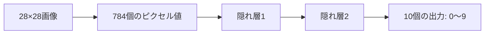

# ニューラルネットワーク全体像

関連: [[00. 学習ガイド]] / [[01. ソース一覧]] / [[01. 図解ギャラリー]]

## このノートのゴール

ニューラルネットワークを「入力を受け取り、層を通して、予測を出す関数」として見る。

## 交互解説 1: 入力から出力まで

### 元ソース

3Blue1Brown は、手書き数字画像を入力して 0〜9 のどれかを出力する例でニューラルネットワークを説明しています。  
出典: [But what is a neural network?](https://www.3blue1brown.com/lessons/neural-networks)

### 解説

ニューラルネットワークは、最初から「数字の形」を理解しているわけではありません。

たとえば 28×28 ピクセルの画像なら、入力は 784 個の数値です。

```text
画像 28×28 pixels → 784 個の数値 → ニューラルネットワーク → 0〜9 のスコア
```

出力側には「0らしさ」「1らしさ」……「9らしさ」を表す値が並びます。いちばん大きい値を予測クラスとして選びます。

### 図で見る

[](https://www.3blue1brown.com/lessons/neural-networks)



### 自分で確認する問い

- [ ] 画像を「数値の表」として扱うとはどういうことか？
- [ ] 出力が1個ではなく10個あるのはなぜか？

## 交互解説 2: ネットワークは関数である

### 元ソース

CS231n は、ニューラルネットワークを「線形分類器を複数層に拡張したもの」として説明します。  
出典: [CS231n Neural Networks Part 1](https://cs231n.github.io/neural-networks-1/)

### 解説

ニューラルネットワークは、数学的には大きな関数です。

$$
\hat{y} = f(x; \theta)
$$

記号の意味:

- $x$: 入力データ
- $\hat{y}$: 予測結果
- $\theta$: 学習されるパラメータ全体。重み $w$ とバイアス $b$ をまとめたもの
- $f$: ニューラルネットワーク全体が表す関数

学習とは、$\theta$ を調整して、$f$ がよい予測を出すようにすることです。

### 図で見る


この図では、左から右に情報が流れます。丸がニューロン、線が重み付きの接続です。

### まとめ

ニューラルネットワークは「データから作る関数」です。入力 $x$ を受け取り、たくさんの重み $\theta$ を使って、予測 $\hat{y}$ を出します。
