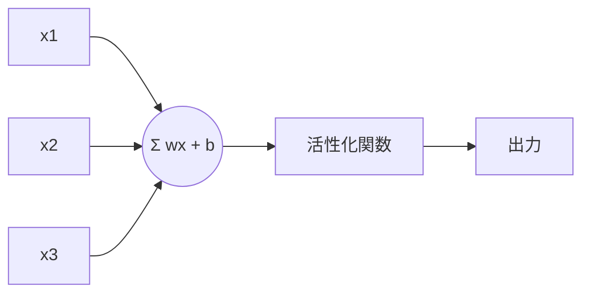

# ニューロンと重み

関連: [[00. 学習ガイド]] / [[01. ニューラルネットワーク全体像]]

## このノートのゴール

1つのニューロンが何を計算しているかを理解する。

## 交互解説 1: ニューロンの計算

### 元ソース

Michael Nielsen のオンラインブックでは、ニューロンを「入力に重みを掛けて足し、しきい値・活性化関数を通して出力するもの」として説明しています。  
出典: [Neural Networks and Deep Learning](http://neuralnetworksanddeeplearning.com/)

### 解説

1つのニューロンは、まず次を計算します。

$$
z = w_1x_1 + w_2x_2 + \cdots + w_nx_n + b
$$

記号の意味:

- $x_i$: 入力の $i$ 番目の値
- $w_i$: その入力をどれくらい重視するかを表す重み
- $b$: バイアス。全体を押し上げたり下げたりする調整値
- $z$: 活性化関数に入れる前の値

重み $w_i$ は「この入力特徴をどれくらい見るか」を表します。バイアス $b$ は「判断の基準点」をずらします。

### 図で見る




### 自分で確認する問い

- [ ] $w_i$ が大きい入力は、出力にどう影響しやすいか？
- [ ] $b$ がないと、どんな表現が難しくなるか？

## 交互解説 2: 行列でまとめて計算する

### 元ソース

CS231n では、層の計算を行列積として扱います。  
出典: [CS231n Neural Networks Part 1](https://cs231n.github.io/neural-networks-1/)

### 解説

ニューロンがたくさんあると、1個ずつ式を書くのは大変です。そこで行列でまとめます。

$$
z = Wx + b
$$

- $x$: 入力ベクトル
- $W$: 重み行列
- $b$: バイアスベクトル
- $z$: 各ニューロンの計算結果を並べたベクトル

この形にすると、GPUで高速に計算しやすくなります。

### ミニ例

```text
入力が3個、出力ニューロンが2個なら
W は 2×3 の行列
x は 3×1 のベクトル
z は 2×1 のベクトル
```

## まとめ

ニューロンの基本は「重み付き和 + バイアス」です。ニューラルネットワーク全体は、この計算を大量に並べたものです。
