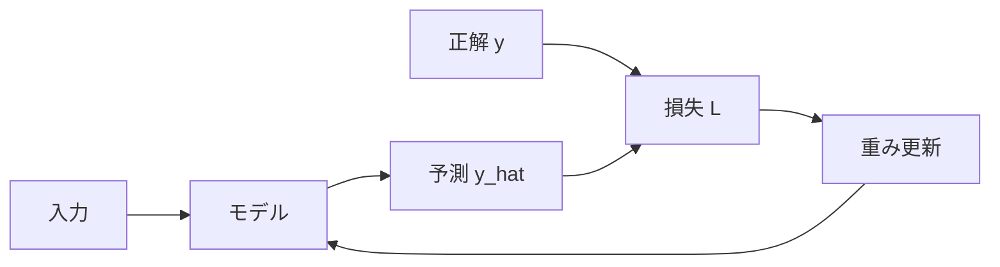
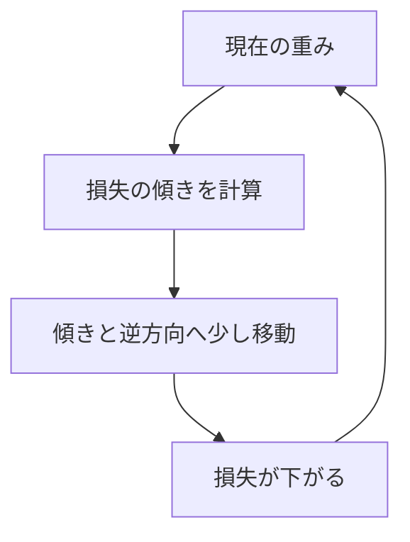
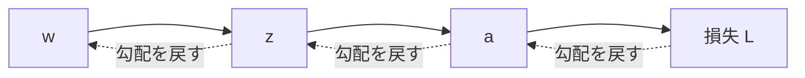

# 損失関数・勾配降下法・逆伝播

関連: [[03. 活性化関数と層]] / [[04. 不明点リスト]]

## このノートのゴール

ニューラルネットワークが「どうやって学習するか」を理解する。

## 交互解説 1: 損失関数

### 元ソース

Dive into Deep Learning と PyTorch Quickstart は、予測と正解のズレを損失関数で測り、それを小さくするように学習する流れを説明しています。  
出典: [Dive into Deep Learning: MLP](https://d2l.ai/chapter_multilayer-perceptrons/index.html), [PyTorch Quickstart](https://docs.pytorch.org/tutorials/beginner/basics/quickstart_tutorial.html)

### 解説

損失関数 $L$ は「予測がどれくらい悪いか」を1つの数値にしたものです。

```text
予測が正解に近い → 損失が小さい
予測が正解から遠い → 損失が大きい
```

学習の目的は、損失 $L$ が小さくなるように重みを変えることです。

### 図で見る



### 自分で確認する問い

- [ ] 分類問題と回帰問題では損失関数がどう違うか？
- [ ] 「損失が小さい」と「正解率が高い」は常に同じ意味か？

## 交互解説 2: 勾配降下法

### 元ソース

3Blue1Brown の gradient descent 解説は、損失の谷を下る直感をアニメーションで示します。  
出典: [Gradient descent, how neural networks learn](https://www.3blue1brown.com/lessons/gradient-descent)

### 解説

重み $w$ の更新は、基本的には次の形です。

$$
w \leftarrow w - \eta \frac{\partial L}{\partial w}
$$

記号の意味:

- $w$: 更新したい重み
- $\eta$: 学習率。どれくらい大きく動かすか
- $L$: 損失
- $\frac{\partial L}{\partial w}$: $w$ を少し変えたら $L$ がどう変わるか

マイナス方向に動くのは、損失が下がる方向へ進みたいからです。

### 図で見る

[](https://www.3blue1brown.com/lessons/gradient-descent)



## 交互解説 3: 逆伝播

### 元ソース

CS231n の Backpropagation ノートは、計算グラフと chain rule によって勾配を効率的に計算する方法を説明しています。  
出典: [CS231n Backpropagation](https://cs231n.github.io/optimization-2/)

### 解説

逆伝播は、出力側で計算された損失から、各重みがどれくらい責任を持っているかを後ろ向きに計算する方法です。

重要なのは chain rule です。

$$
\frac{\partial L}{\partial w} = \frac{\partial L}{\partial z} \frac{\partial z}{\partial w}
$$

これは、「$w$ が $z$ に与える影響」と「$z$ が $L$ に与える影響」を掛け合わせる、という意味です。

### 図で見る



## まとめ

学習は次のループです。

1. 予測する
2. 損失を測る
3. 逆伝播で勾配を計算する
4. 勾配降下法で重みを更新する
5. 繰り返す
